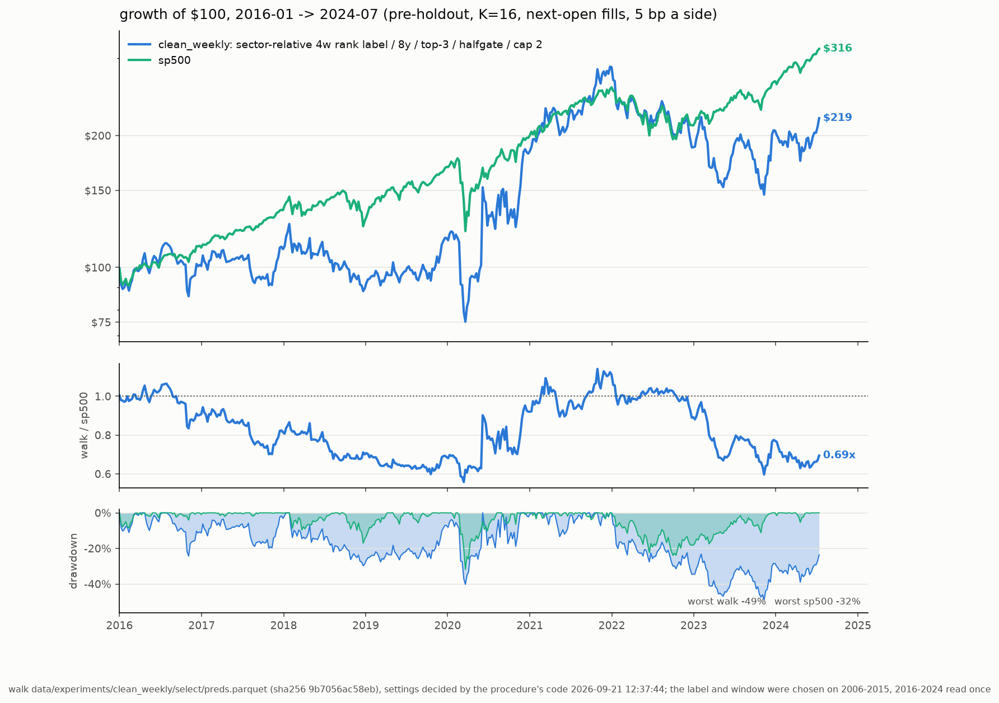

# stocks_ml

`stocks_ml` ranks S&P 500 stocks on a one-month horizon with a small
gradient-boosted model, wraps the ranking in a rules-based long-only book
with an index/Treasury ballast, and runs that system every week as a $100
paper portfolio. The data is point-in-time, the selection procedure is
mechanical and written as code, and the last two years are a sealed holdout.

There is no broker integration. The weekly job proposes a book; a human
places the orders.

## The champion

The deployed system is specified in
[models/champion_spec.json](models/champion_spec.json) and summarized in
[PROCEDURE.md](PROCEDURE.md). Both, and the block below, are generated by
the commands (`stocks-ml procedure`, `eval`, `procedure-card`), never
edited by hand.

<!-- champion:begin (stocks-ml procedure-card) -->
| Component | Setting |
|---|---|
| Model | XGBoost: gradient-boosted trees of depth 3, learning rate 0.02, up to 1,500 rounds with early stopping on a time-ordered tail (weekly rank correlation), 16 bootstrap-seeded copies averaged; parameters fixed, never tuned (tuning measured as noise) (`selection.MODEL_PARAMS`) |
| Target | the stock's 4-week return minus the same-week median of its sector, replaced by its within-week rank as a normal score; 35-day purge |
| Training | refit every week on the trailing 8 years; early stopping on a purged, time-ordered tail |
| Ensemble | 16 copies (seed + whole-week bootstrap), scores averaged |
| Features | the point-in-time panel's `f_` columns: prices, fundamentals, filings, insider trades, short interest, macro plus 8 named columns |
| Book | top-3 per sleeve, equal weight, 4 staggered sleeves — one rotates each week, so every name is held 4 weeks; at most 2 per sector; no stop-loss; no volatility cut |
| Ballast | halfgate: book 100/83/67/50% of NAV by SPY trend gates down (30/40/52w), rest IEF — the book shrinks one sixth of NAV per breached SPY trailing MA, the freed money sits in IEF (no fixed SPY ballast) |
| Costs | 5 bp one-way, fills at the next session's open |

**Record** (`stocks-ml eval`, [reports/clean_weekly_eval.md](reports/clean_weekly_eval.md), 2026-09-21), $100 at the start of each span, costs included, holdout excluded:

| model | 2006-2024: $100, %/yr | SR, DD | 2016-2024: $100, %/yr | SR, DD | 2006-2015: $100, %/yr | SR, DD | weekly t vs sp500 (06-24 / 16-24) |
|---|---|---|---|---|---|---|---|
| champion | $1,290, +14.8% | 0.58, 54% | $219, +9.6% | 0.43, 49% | $588, +19.4% | 0.71, 54% | +1.28 / -0.02 |
| sp500 | $621, +10.3% | 0.64, 55% | $316, +14.3% | 0.87, 32% | $197, +7.0% | 0.46, 55% | — |

2006–2015 is where the label, window and strategy layers were chosen. 2016–2024 was read once, for this grade. The excess over the S&P 500 on 2016–2024 is -4.2%/yr; resampling both the model's seeds and the history gives a 95% interval of -18.1 to +11.3%/yr, and 28% of the resampled histories beat the index. Leak audit PASS. The rank label tempers the target, so the model buys less volatile, less beaten-down names than its predecessor (volatility rank 0.48 vs 0.60 among its picks on 2006-2015, 12-month momentum -0.16 vs -0.36) and its book swings less month to month. It still trails the index in the same years the predecessor did (2011, 2014, 2015; 2010-2015 as a whole $158 vs the S&P's $207, with a shallower worst drop, 24% vs 33%), so the edge remains concentrated in rebound years. Worst drawdowns: 54% on 2006–2015 and 49% on 2016–2024 (the S&P: 55% and 32%). Sizing should assume index-like outcomes in adverse regimes. The holdout (2024-07-19 onward) has never been graded.



The chart shows the out-of-sample years only. 2006–2015 chose the settings, so a curve that includes it overstates the model.
<!-- champion:end -->

## The processes

Everything the project does is one of eleven commands
([src/stocks_ml/cli.py](src/stocks_ml/cli.py)). Each reads
[config/config.yaml](config/config.yaml) and the research world under
`data/` (git-ignored, licensed).

```
world ──▶ train ──▶ procedure ──▶ eval ──▶ app
                 └─▶ backtest                        r5-weekly (live, every Saturday)
          challenge-fast ──▶ challenge (= train + backtest + leak audit [+ eval] for candidate recipes)
```

| command | what it does | writes | code |
|---|---|---|---|
| `stocks-ml world` | refresh a world store (Sharadar + SEC) and rebuild its feature panel | `<store>/panel_sf.parquet` | [data/world.py](src/stocks_ml/data/world.py) |
| `stocks-ml train` | the walk: refit the model every week of a window, 16 copies, scores saved | `<walk>/{select,extend}/preds.parquet` + `spec.json` | [train.py](src/stocks_ml/train.py) |
| `stocks-ml backtest` | a walk through the strategy: the table above, at the spec's settings or others; `--rolling` follows the rolling procedure instead | stdout (`<walk>/rolling/*.json`) | [backtest.py](src/stocks_ml/backtest.py), [rolling.py](src/stocks_ml/rolling.py) |
| `stocks-ml procedure` | decide the strategy layers on the walk's 2006–2015 segment and write them, with the walk's label and window, into the spec; `--lookback` chooses among rolling rules | `models/champion_spec.json`, `PROCEDURE.md` | [procedure.py](src/stocks_ml/procedure.py) |
| `stocks-ml eval` | the one look: the table, 95% intervals, the falsification test against an incumbent, the leak audit, the charts | `<walk>/eval.json`, `reports/champion_eval.md`, two charts | [eval.py](src/stocks_ml/eval.py), [leak_audit.py](src/stocks_ml/leak_audit.py) |
| `stocks-ml app` | the interactive explorer of the champion's backtest, week by week | `reports/champion_explorer.html` (git-ignored) | [app/build.py](src/stocks_ml/app/build.py) |
| `stocks-ml challenge` | the challenger protocol: candidate recipes vs the incumbent — sample, every-week comparison, leak audit, optionally K=16 and the one look | `<out>/challenge.json`, the candidates' walks | [challenge.py](src/stocks_ml/challenge.py) |
| `stocks-ml challenge-fast` | the prototype: the same candidates on a stratified random sample of 2006–2015 at K=16 vs both seed sets of the incumbent, flagged against the seed-twin null; ranks only | `<out>/fast_<n>x_s<seed>.json` | [challenge.py](src/stocks_ml/challenge.py) |
| `stocks-ml explain` | Shapley feature importance of the champion: one fit per year, exact TreeSHAP on the members scored that week | `reports/champion_shap.png`, `reports/champion_shap.md` | [explain.py](src/stocks_ml/explain.py) |
| `stocks-ml procedure-card` | PROCEDURE.md from the spec | `PROCEDURE.md` | [procedure_card.py](src/stocks_ml/procedure_card.py) |
| `stocks-ml r5-weekly` | the live signal: refresh, rank, rotate a sleeve, keep the paper ledger | `signals_r5/`, `ledger_r5.json` | [live/r5.py](src/stocks_ml/live/r5.py) |

### Reproducing the champion

```bash
uv sync
W=data/experiments/labels/rank_k16                        # the champion's walk
stocks-ml train --out $W/select --start 2006-01-01 --end 2015-12-31 --label label_4w_sector_rank --train-years 8
stocks-ml train --out $W/extend --start 2016-01-01 --end 2024-07-18 --label label_4w_sector_rank --train-years 8
stocks-ml procedure --preds $W/select/preds.parquet       # decides book/ballast/stop/cap, writes the spec
stocks-ml eval                                            # the table, intervals, leak audit, charts
stocks-ml app                                             # the explorer
```

A 16-copy walk of one segment takes a few hours on a laptop
(`train --every 4 --k 4` gives a cheap sample for exploration; the
procedure refuses samples). `stocks-ml train --check $W/select/preds.parquet`
refits the first weeks and confirms the saved walk reproduces bit for bit.
`stocks-ml procedure --check` confirms the spec still matches the walk.

### Challenging the champion

One command runs the whole protocol ([challenge.py](src/stocks_ml/challenge.py)).
A candidate is a **recipe**: a label, a training window, extra panel
columns (`features=a+b`), admitted columns withheld (`drop=f_x+f_y`),
overrides of the model parameters, another world to walk on
(`store=data/<world>`, e.g. the top-2000 universe built by
`stocks-ml world --dir <world> --top 2000`), or a training universe
(`train_top=500`: fit on the largest 500 names, score every member) —
anything `train` can walk. Fields you don't name come from the incumbent's
recipe. `--adjudicate` adds the head-to-head on 2016-2019: the incumbent
was selected on 2006-2015 and its score there is inflated, so the
challenger's winner and the incumbent meet once on a window neither was
chosen on, each at its own settings, against the incumbent's seed twin.

```bash
stocks-ml challenge --out data/experiments/challenges/labels \
    --candidate label=label_4w_sector_rank --candidate label=label_4w_sector_log \
    --candidate train_years=5 --candidate "params=learning_rate:0.01" --k16
```

1. **Sample** (every 4th week of 2006–2015, K=4) for each candidate, and
   the incumbent's own walk cut to the same weeks and copies. It ranks
   only; the top two go on.
2. **Every week** of 2006–2015 at K=16, the deployed ensemble size (at K=4,
   models that K=16 separates are coin flips). The **model score** is the mean
   over the top-3, top-6 and top-10 books of the cost-adjusted compounded
   %/yr (`selection.decide_book`: the same three numbers the procedure's
   book layer takes the argmax of), on the weeks all walks share. One book
   would miss a recipe that shines at another size; the mean over the menu
   is steadier than any one book and cannot be won by a lucky spike. The
   paired weekly t and the single-copy spread are reported, not gated; the
   leak audit must pass. The argmax of the score — incumbent included — is
   the frozen model. No significance is required in either direction: the
   incumbent never met such a bar either.
3. **The one look** (`--k16`): the winner's 2016–2024 segment at K=16 (its
   2006–2015 walk is the stage-2 one), then
   `stocks-ml eval --incumbent`: the table, the intervals, the
   falsification test (a challenger is rejected only if it is significantly
   *worse* than the incumbent on 2016–2024, paired weekly t < −2) and the
   leak audit.
4. **Adopt** with `stocks-ml procedure --preds <winner>/select/preds.parquet`,
   on the owner's go. The procedure writes the recipe — label, window,
   features, params — into the spec, and the weekly job trains on it.

The constants (sample spacing, copies, the comparison book, how many
advance) sit at the top of `challenge.py`; changing a rule is one visible
edit, made before a test, never after seeing who wins. Every stage writes
a ledger row and `<out>/challenge.json`.

### Prototyping with `challenge-fast`

Any change — a label, a window, a feature set, a parameter — is first a
prototype:

```bash
stocks-ml challenge-fast --out data/experiments/fast/labels \
    --candidate label=label_4w_sector_rank --candidate train_years=5 --candidate "params=max_depth:4"
```

It walks each candidate on a stratified random sample of 2006–2015 (26
weeks from each year, one fixed seed, so every candidate sees the same
weeks) at K=16, the deployed ensemble size, and cuts the incumbent's own
walk to those weeks and copies. Under an hour per candidate.

Its calibration is the **seed twin**: the incumbent's own recipe walked
again with sixteen fresh seeds, once per champion. Two seed sets of the
same recipe differ by a couple of points on the score (the champion's:
+13.3 and +15.8 on the full walk), so the incumbent is represented by
both, a candidate's gap is measured against the luckier one, and the twin
against the incumbent on a thousand other draws of the same sample design,
centred, is what a boost of zero looks like. Each gap is reported as a
percentile of that null (its P(boost)) and flagged only above the 90th,
so the false-positive rate is a measured 10%. A seven-point boost like
the rank label's is caught about two times in three at 26 weeks a year;
gaps of a point or two are inside seed noise, unflaggable by any fast
method, and the 12-year-window case suggests not worth having. The full
`challenge` counts both seed sets too: a winner must beat both. It ranks
and decides nothing; what is flagged comes back as a ready `challenge`
line. The selection window is always
2006–2015; 2016–2024 is touched only by `challenge --k16`, once, for a
winner. Strategy layers need no walk: prototype a menu change with
`backtest --book/--floor/--stop/--cap` on the champion's saved walk.

Every evaluated configuration is in
[models/trials_ledger.json](models/trials_ledger.json). The holdout is
graded once, on the owner's go, after all choices are frozen.

### The rolling procedure

The fixed procedure decides the strategy layers once, on 2006–2015. The
rolling procedure ([rolling.py](src/stocks_ml/rolling.py)) re-decides them
at every rank week on the trailing *k* years of the walk's own
out-of-sample predictions (window ending five weeks earlier, so every
four-week return in it is realized), and *k* is itself chosen on the
selection window: each rule is followed and graded on a common span, the
argmax by compounded %/yr wins, and 2016–2024 is read once for the winner.
The walk needs a pre-2006 segment for the burn-in (the run below was on
the previous champion's walk, `data/experiments/clean_program/stage_e/ls_w8`):

```bash
stocks-ml train --out $W/pre --start 2002-01-01 --end 2005-12-31 --label label_4w_sector --train-years 8
for R in 8 5 3 expanding; do
  stocks-ml backtest --preds $W/pre/preds.parquet $W/select/preds.parquet $W/extend/preds.parquet \
    --rolling $R --sel-start 2010-01-08 --sel-end 2015-12-31    # graded inside the selection window only
done
stocks-ml procedure --lookback $W/rolling/*.json --sel-start 2010-01-08 --sel-end 2015-12-31
```

Run on 2026-09-13 (ledger `rolling_lookback_2010-2015_trailing_5_c1`): the
trailing rules change their mind every 5–7 weeks and almost never land on
the champion's configuration; on 2010–2015 every rule, and the fixed
settings too, trailed the S&P 500. The chosen rule (trailing 5 years) read
$610 (+23.5%/yr, SR 0.89, DD 41%) on 2016–2024 against the fixed settings'
$660 (+24.6%, 0.88, 33%), paired weekly t −0.35: the layers are within
noise of each other, and the model, not the layers, carries the edge. The
spec stays fixed.

## The weekly job

[`.github/workflows/champion.yml`](.github/workflows/champion.yml) runs
`stocks-ml r5-weekly --commit` every Saturday 13:00 UTC:

1. **Refresh the live world** ([data/world.py](src/stocks_ml/data/world.py)):
   Sharadar S&P 500 membership, prices (incremental, upserted by ticker and
   date), fundamentals, insider filings; SEC EDGAR company facts and 8-Ks,
   FINRA short interest, FRED. Symbol renames are detected by permanent
   ticker id and rewritten in every stored table.
2. **Rebuild the panel** with the research recipe, then fit the 16-copy
   ensemble on the spec's label and window and rank every current member —
   the same code `stocks-ml train` runs for one week.
3. **Rotate the due sleeve**, set the ballast state from SPY's trailing
   means, write target weights.
4. **Keep the paper ledger** ([ledger_r5.json](ledger_r5.json)): fill last
   week's targets at Monday's open, sells before buys, 5 bp each way, never
   overdrawn; mark NAV at Friday's close against SPY from the same $100.
5. **Commit** `signals_r5/<friday>.md` (the book with per-name deltas, the
   sleeves, the top-15 candidates, data freshness) and the ledger.

A run fails loudly rather than signal on stale data. Manual runs
(`workflow_dispatch`) accept `as_of` and `dry_run`;
[ops/r5_weekly.sh](ops/r5_weekly.sh) runs the same cycle on a Mac.

**Licensed data never enters this public repository.** The Sharadar key is
the `SHARADAR_API_KEY` secret. The live store travels between runs as an
AES-256 tarball in the Actions cache (`R5_STORE_KEY`); when the cache is
empty the run seeds itself from a draft release uploaded by
[ops/r5_seed.sh](ops/r5_seed.sh).

## Data

- **Sharadar** (Nasdaq Data Link, licensed; key in `data/.sharadar_key` or
  `SHARADAR_API_KEY`): S&P 500 constituents with join/leave dates, daily
  prices for every historical member including delisted ones, quarterly
  fundamentals dated by filing, insider transactions. This is what makes the
  universe survivorship-clean.
- **SEC EDGAR** company facts and 8-K filings, **SEC Form 4** insider
  filings, **FINRA** short interest, **FRED** macro series (only the
  ALFRED-audited `T10Y2Y` and `FEDFUNDS` families are features).

Point-in-time rules: membership is effective-dated; filings become usable
the next calendar day; FINRA and macro observations carry their publication
lags; features are rank-normalized within each week; the label starts at
the next open; training, early stopping and validation are separated by
purge gaps sized to the label. Level features use the nominal close (what
the tape showed) so no future split adjustment reaches the model; a name
that delists mid-hold is graded to its last print, as the ledger would
exit it. [tests/test_no_lookahead.py](tests/test_no_lookahead.py) corrupts
future inputs and requires past outputs to stay unchanged — if it fails,
fix the implementation, not the test.

## Installation

Python 3.10–3.12. Eight runtime dependencies (pandas, numpy, pyarrow, pyyaml,
requests, scikit-learn, xgboost, scipy); `uv sync --group eval` adds
matplotlib for the charts.

```bash
uv sync
uv run pytest            # must stay green with zero warnings; no network
uv run stocks-ml --help
```

## Where to look

- [AGENTS.md](AGENTS.md) — project context for coding agents: the tree,
  the rules, the owner's standing instructions.
- [PROCEDURE.md](PROCEDURE.md) — the champion's procedure card (generated).
- [reports/clean_improvement.md](reports/clean_improvement.md) — the
  program that chose the champion's label and window.
- [reports/champion_eval.md](reports/champion_eval.md) — the current grade.
- [docs/simplification_log.md](docs/simplification_log.md) — what was
  removed on 2026-09-13 and where it lives (tag `pre-simplify`).
- The research history — every campaign, driver and report before the
  simplification — is at the git tag `pre-simplify`; the legacy one-week
  pipeline is at `legacy-final`.
