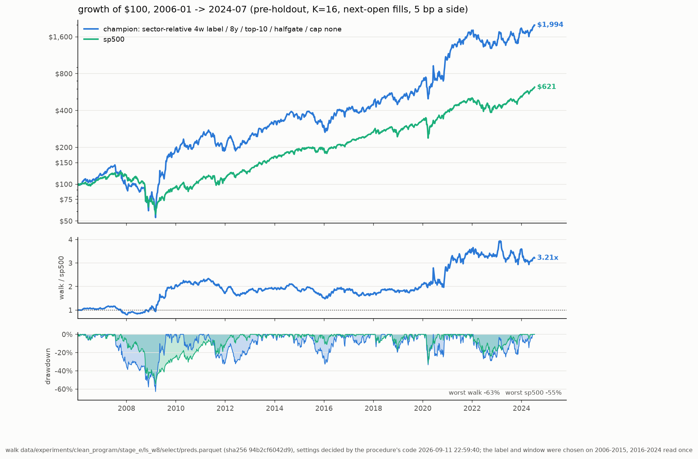

# stocks_ml

`stocks_ml` ranks S&P 500 stocks on a one-month horizon with a small
gradient-boosted model, wraps the ranking in a rules-based long-only book
with an index/Treasury ballast, and runs that system every week as a $100
paper portfolio. The data is point-in-time, the selection procedure is
mechanical and written as code, and the last two years are a sealed holdout.

There is no broker integration. The weekly job proposes a book; a human
places the orders.

## The champion

The deployed system is specified in
[models/champion_spec.json](models/champion_spec.json) and summarized in
[PROCEDURE.md](PROCEDURE.md). Both are generated by the commands below,
never edited by hand.

| Component | Setting |
|---|---|
| Model | depth-3 XGBoost, fixed parameters (`selection.MODEL_PARAMS`), never tuned |
| Target | the stock's 4-week open-to-open return minus the same-week median of its sector; 35-day purge |
| Training | refit every week on the trailing 8 years; early stopping on a purged, time-ordered tail |
| Ensemble | 16 copies (seed + whole-week bootstrap), scores averaged |
| Features | the point-in-time panel's 64 `f_` columns: prices, fundamentals, filings, insider trades, short interest, macro |
| Book | top-10, equal weight, four staggered sleeves — one rotates each week, so every name is held four weeks; no sector cap; no stop-loss |
| Ballast | half-gate: the book holds 100 / 83 / 67 / 50% of NAV as 0 / 1 / 2 / 3 of SPY's trailing means (30 / 40 / 52 weeks) are breached; the rest sits in IEF |
| Costs | 5 bp one-way, fills at the next session's open |

**Record** (`stocks-ml eval`, [reports/champion_eval.md](reports/champion_eval.md)),
$100 at the start of each span, costs included, holdout excluded:

| model | 2006-2024: $100, %/yr | SR, DD | 2016-2024: $100, %/yr | SR, DD | 2006-2015: $100, %/yr | SR, DD | weekly t vs sp500 (06-24 / 16-24) |
|---|---|---|---|---|---|---|---|
| champion | $1,994, +17.5% | 0.70, 63% | $660, +24.6% | 0.88, 33% | $302, +11.7% | 0.53, 63% | +1.90 / +1.52 |
| sp500 | $621, +10.3% | 0.64, 55% | $316, +14.3% | 0.87, 32% | $197, +7.0% | 0.46, 55% | — |

2006–2015 is where the label, window and strategy layers were chosen.
2016–2024 was read once, for this grade. The excess over the S&P 500 on
2016–2024 is +9.0%/yr; resampling both the model's seeds and the history
gives a 95% interval of −3.9 to +24.2%/yr, and 91% of the resampled
histories beat the index. The edge is era-concentrated: the book buys
volatile, beaten-down names, so its good years are rebound years (2009,
2016, 2019–2021), it is index-like in 2010–2015 and 2022–2024, and it fell
further than the index in 2008–09 (63% vs 55%). Sizing should assume
index-like outcomes in adverse regimes. The holdout (2024-07-19 onward)
has never been graded.



## The processes

Everything the project does is one of eight commands
([src/stocks_ml/cli.py](src/stocks_ml/cli.py)). Each reads
[config/config.yaml](config/config.yaml) and the research world under
`data/` (git-ignored, licensed).

```
world ──▶ train ──▶ procedure ──▶ eval ──▶ app
                 └─▶ backtest                        r5-weekly (live, every Saturday)
```

| command | what it does | writes | code |
|---|---|---|---|
| `stocks-ml world` | refresh a world store (Sharadar + SEC) and rebuild its feature panel | `<store>/panel_sf.parquet` | [data/world.py](src/stocks_ml/data/world.py) |
| `stocks-ml train` | the walk: refit the model every week of a window, 16 copies, scores saved | `<walk>/{select,extend}/preds.parquet` + `spec.json` | [train.py](src/stocks_ml/train.py) |
| `stocks-ml backtest` | a walk through the strategy: the table above, at the spec's settings or others | stdout | [backtest.py](src/stocks_ml/backtest.py) |
| `stocks-ml procedure` | decide the strategy layers on the walk's 2006–2015 segment and write them, with the walk's label and window, into the spec | `models/champion_spec.json`, `PROCEDURE.md` | [procedure.py](src/stocks_ml/procedure.py) |
| `stocks-ml eval` | the one look: the table, 95% intervals, the falsification test against an incumbent, the leak audit, the charts | `<walk>/eval.json`, `reports/champion_eval.md`, two charts | [eval.py](src/stocks_ml/eval.py), [leak_audit.py](src/stocks_ml/leak_audit.py) |
| `stocks-ml app` | the interactive explorer of the champion's backtest, week by week | `reports/champion_explorer.html` (git-ignored) | [app/build.py](src/stocks_ml/app/build.py) |
| `stocks-ml procedure-card` | PROCEDURE.md from the spec | `PROCEDURE.md` | [procedure_card.py](src/stocks_ml/procedure_card.py) |
| `stocks-ml r5-weekly` | the live signal: refresh, rank, rotate a sleeve, keep the paper ledger | `signals_r5/`, `ledger_r5.json` | [live/r5.py](src/stocks_ml/live/r5.py) |

### Reproducing the champion

```bash
uv sync
W=data/experiments/clean_program/stage_e/ls_w8            # the champion's walk
stocks-ml train --out $W/select --start 2006-01-01 --end 2015-12-31 --label label_4w_sector --train-years 8
stocks-ml train --out $W/extend --start 2016-01-01 --end 2024-07-18 --label label_4w_sector --train-years 8
stocks-ml procedure --preds $W/select/preds.parquet       # decides book/ballast/stop/cap, writes the spec
stocks-ml eval                                            # the table, intervals, leak audit, charts
stocks-ml app                                             # the explorer
```

A 16-copy walk of one segment takes a few hours on a laptop
(`train --every 4 --k 4` gives a cheap sample for exploration; the
procedure refuses samples). `stocks-ml train --check $W/select/preds.parquet`
refits the first weeks and confirms the saved walk reproduces bit for bit.
`stocks-ml procedure --check` confirms the spec still matches the walk.

### Challenging the champion

1. Walk the challenger on 2006–2015 (`train`) and run `backtest` on it
   and on the champion's `select` segment. The first line each prints is
   the **selection metric**: the cost-adjusted compounded %/yr of the
   top-6 book on 2006–2015 (`selection.decide_book`, the number the
   procedure's book layer reads). The higher one wins — the argmax
   decides; doubts become pre-registered falsification tests, never
   discretionary overrides.
2. Walk the winner on 2016–2024 (`train`) and read it once:
   `stocks-ml eval --walk <challenger> --incumbent $W`. The falsification
   test (paired weekly excess over the incumbent on 2016–2024, t < −2
   rejects) and the leak audit must pass.
3. Adopt with `stocks-ml procedure --preds <challenger>/select/preds.parquet`.

Every evaluated configuration is in
[models/trials_ledger.json](models/trials_ledger.json). The holdout is
graded once, on the owner's go, after all choices are frozen.

## The weekly job

[`.github/workflows/champion.yml`](.github/workflows/champion.yml) runs
`stocks-ml r5-weekly --commit` every Saturday 13:00 UTC:

1. **Refresh the live world** ([data/world.py](src/stocks_ml/data/world.py)):
   Sharadar S&P 500 membership, prices (incremental, upserted by ticker and
   date), fundamentals, insider filings; SEC EDGAR company facts and 8-Ks,
   FINRA short interest, FRED. Symbol renames are detected by permanent
   ticker id and rewritten in every stored table.
2. **Rebuild the panel** with the research recipe, then fit the 16-copy
   ensemble on the spec's label and window and rank every current member —
   the same code `stocks-ml train` runs for one week.
3. **Rotate the due sleeve**, set the ballast state from SPY's trailing
   means, write target weights.
4. **Keep the paper ledger** ([ledger_r5.json](ledger_r5.json)): fill last
   week's targets at Monday's open, sells before buys, 5 bp each way, never
   overdrawn; mark NAV at Friday's close against SPY from the same $100.
5. **Commit** `signals_r5/<friday>.md` (the book with per-name deltas, the
   sleeves, the top-15 candidates, data freshness) and the ledger.

A run fails loudly rather than signal on stale data. Manual runs
(`workflow_dispatch`) accept `as_of` and `dry_run`;
[ops/r5_weekly.sh](ops/r5_weekly.sh) runs the same cycle on a Mac.

**Licensed data never enters this public repository.** The Sharadar key is
the `SHARADAR_API_KEY` secret. The live store travels between runs as an
AES-256 tarball in the Actions cache (`R5_STORE_KEY`); when the cache is
empty the run seeds itself from a draft release uploaded by
[ops/r5_seed.sh](ops/r5_seed.sh).

## Data

- **Sharadar** (Nasdaq Data Link, licensed; key in `data/.sharadar_key` or
  `SHARADAR_API_KEY`): S&P 500 constituents with join/leave dates, daily
  prices for every historical member including delisted ones, quarterly
  fundamentals dated by filing, insider transactions. This is what makes the
  universe survivorship-clean.
- **SEC EDGAR** company facts and 8-K filings, **SEC Form 4** insider
  filings, **FINRA** short interest, **FRED** macro series (only the
  ALFRED-audited `T10Y2Y` and `FEDFUNDS` families are features).

Point-in-time rules: membership is effective-dated; filings become usable
the next calendar day; FINRA and macro observations carry their publication
lags; features are rank-normalized within each week; the label starts at
the next open; training, early stopping and validation are separated by
purge gaps sized to the label. Level features use the nominal close (what
the tape showed) so no future split adjustment reaches the model; a name
that delists mid-hold is graded to its last print, as the ledger would
exit it. [tests/test_no_lookahead.py](tests/test_no_lookahead.py) corrupts
future inputs and requires past outputs to stay unchanged — if it fails,
fix the implementation, not the test.

## Installation

Python 3.10–3.12. Eight runtime dependencies (pandas, numpy, pyarrow, pyyaml,
requests, scikit-learn, xgboost, scipy); `uv sync --group eval` adds
matplotlib for the charts.

```bash
uv sync
uv run pytest            # must stay green with zero warnings; no network
uv run stocks-ml --help
```

## Where to look

- [AGENTS.md](AGENTS.md) — project context for coding agents: the tree,
  the rules, the owner's standing instructions.
- [PROCEDURE.md](PROCEDURE.md) — the champion's procedure card (generated).
- [reports/clean_improvement.md](reports/clean_improvement.md) — the
  program that chose the champion's label and window.
- [reports/champion_eval.md](reports/champion_eval.md) — the current grade.
- [docs/simplification_log.md](docs/simplification_log.md) — what was
  removed on 2026-09-13 and where it lives (tag `pre-simplify`).
- The research history — every campaign, driver and report before the
  simplification — is at the git tag `pre-simplify`; the legacy one-week
  pipeline is at `legacy-final`.
