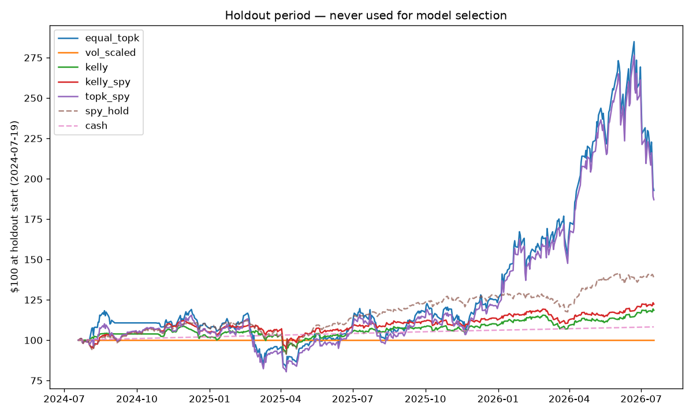
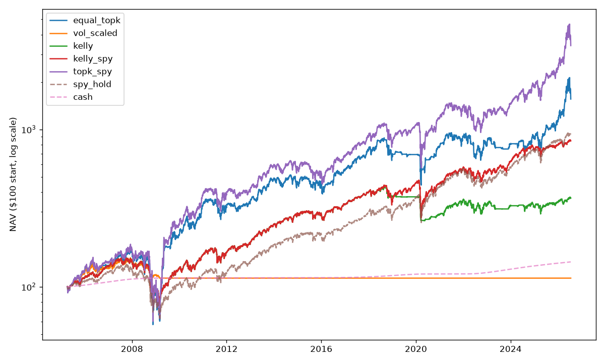

# Backtest report

Champion model: **xgb_tuned** · strategies × candidates tried: **45** (used to deflate Sharpe)

## Headline ($100 invested at start)

| strategy | $100 → | CAGR | Sharpe | Deflated Sharpe | Sortino | max DD | worst week | underwater (d) | costs $ | fits |
|---|---|---|---|---|---|---|---|---|---|---|
| equal_topk | $3,558 | 18.3% | 0.66 | 0.78 | 1.04 | 76.2% | -30.6% | 1361 | 326.90 | 275 |
| vol_scaled | $178 | 2.7% | 0.39 | 0.33 | 0.56 | 25.8% | -8.6% | 5559 | 14.36 | 275 |
| kelly | $554 | 8.4% | 0.53 | 0.58 | 0.82 | 48.8% | -21.1% | 1123 | 36.05 | 275 |
| kelly_spy | $1,274 | 12.7% | 0.71 | 0.84 | 1.10 | 48.8% | -21.1% | 1123 | 63.00 | 275 |
| topk_spy | $6,779 | 21.9% | 0.74 | 0.87 | 1.17 | 76.2% | -30.6% | 1037 | 502.40 | 275 |
| spy_hold | $930 | 11.1% | 0.65 | – | 1.01 | 55.2% | -19.8% | 1773 | – | – |
| cash | $144 | 1.7% | 14.57 | – | 28,157.27 | 0.0% | -0.0% | 16 | – | – |

## Regime-sliced performance (ann. Sharpe / hit rate)

| strategy | bull | bear | high_vol | low_vol |
|---|---|---|---|---|
| equal_topk | 1.50 / 46.3% | -0.45 / 47.1% | -0.18 / 43.8% | 2.34 / 48.7% |
| vol_scaled | 1.16 / 15.2% | -1.29 / 23.4% | -0.61 / 20.0% | 1.66 / 14.4% |
| kelly | 1.57 / 46.9% | -0.58 / 47.9% | -0.33 / 43.8% | 2.85 / 49.8% |
| kelly_spy | 1.84 / 56.6% | -0.69 / 48.6% | -0.41 / 49.5% | 3.51 / 59.4% |
| topk_spy | 1.68 / 56.4% | -0.55 / 48.0% | -0.24 / 49.8% | 2.68 / 58.7% |
| spy_hold | 1.84 / 57.1% | -0.94 / 47.6% | -0.68 / 48.6% | 3.85 / 60.5% |
| cash | 14.38 / 100.0% | 16.14 / 98.3% | 12.74 / 99.3% | 16.37 / 99.9% |

## Stress windows (total return)

| window | equal_topk | vol_scaled | kelly | kelly_spy | topk_spy | spy_hold | cash |
|---|---|---|---|---|---|---|---|
| GFC | -53.2% | -10.3% | -34.0% | -34.0% | -53.2% | -36.6% | 0.2% |
| Q4 2018 | -5.5% | 0.0% | -3.9% | -12.8% | -12.5% | -13.8% | 0.6% |
| COVID crash | 6.0% | 0.0% | 1.1% | -17.3% | -13.3% | -17.0% | 0.1% |
| 2022 bear | -36.3% | 0.0% | -10.3% | -10.3% | -36.3% | -18.6% | 2.0% |

## Holdout period (≥ 2024-07-19, never used for model selection — the primary strategy comparison)

| strategy | $100 → | total return | ann. Sharpe | max DD | worst week |
|---|---|---|---|---|---|
| equal_topk | $193 | 92.7% | 1.01 | 32.3% | -15.8% |
| vol_scaled | $100 | 0.0% | – | 0.0% | 0.0% |
| kelly | $119 | 18.5% | 0.73 | 15.7% | -7.5% |
| kelly_spy | $122 | 22.3% | 0.80 | 15.7% | -7.5% |
| topk_spy | $187 | 87.0% | 0.98 | 32.3% | -15.8% |
| spy_hold | $139 | 38.6% | 1.05 | 18.8% | -9.1% |
| cash | $108 | 8.2% | 157.31 | 0.0% | 0.1% |

## Recent five years ($100 at 2021-07-17; overlaps model-selection window — see holdout for the clean test)

| strategy | $100 → | CAGR | Sharpe | max DD |
|---|---|---|---|---|
| equal_topk | $221 | 17.2% | 0.64 | 45.7% |
| vol_scaled | $100 | 0.0% | – | 0.0% |
| kelly | $130 | 5.4% | 0.46 | 20.3% |
| kelly_spy | $176 | 12.0% | 0.84 | 20.3% |
| topk_spy | $280 | 22.9% | 0.77 | 45.7% |
| spy_hold | $187 | 13.4% | 0.82 | 24.5% |
| cash | $119 | 3.6% | 33.40 | 0.0% |

## Honesty notes

- Sharpe deflation assumes 45 strategy/model trials.
- Regime flags (SPY 200d SMA, VIX median) use full-sample statistics; they are reporting lenses, not tradable signals.
- Fundamentals are sparse before ~2009 (EDGAR XBRL phase-in).
- Delisted tickers missing from the free price source are absent from the panel; residual survivorship bias is reported in the ingestion manifest.
- Positions whose ticker stops trading are liquidated at the last available (forward-filled) price — optimistic for bankruptcies.

