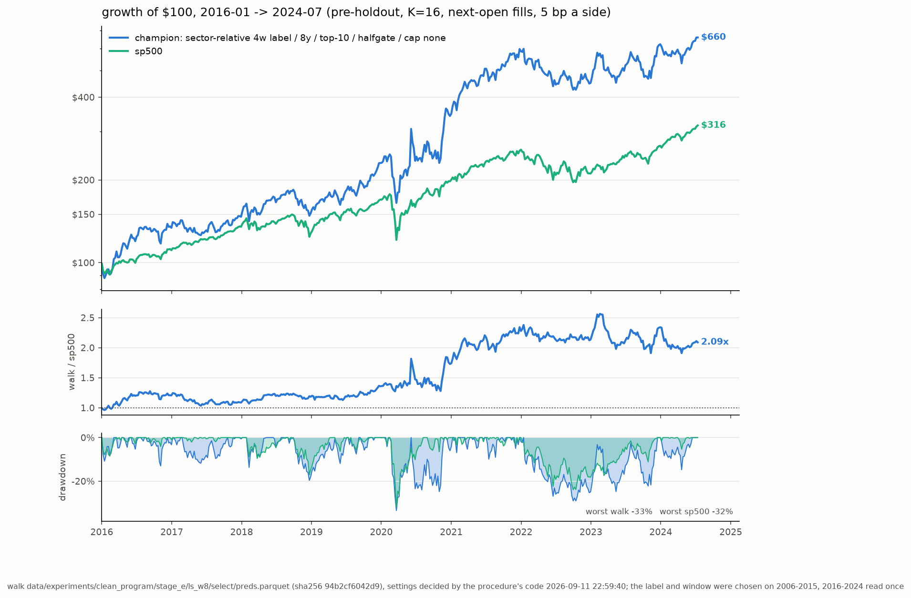

# champion: the one look

Walk `data/experiments/clean_program/stage_e/ls_w8` (sector-relative 4w label / 8y / top-10 / halfgate / cap none) at K=16, settings top-10 / halfgate / stop None / cap None decided by `stocks-ml procedure`'s code on its 2006-2015 segment. $100 at each span's start; pre-tax (Roth); pre-holdout only. Generated 2026-09-13 14:16:53 by `stocks-ml eval`.

| model | 2006-2024: $100, %/yr | SR, DD | 2016-2024: $100, %/yr | SR, DD | 2006-2015: $100, %/yr | SR, DD | weekly t vs sp500 (06-24 / 16-24) |
|---|---|---|---|---|---|---|---|
| champion | $1,994, +17.5% | 0.70, 63% | $660, +24.6% | 0.88, 33% | $302, +11.7% | 0.53, 63% | +1.90 / +1.52 |
| sp500 | $621, +10.3% | 0.64, 55% | $316, +14.3% | 0.87, 32% | $197, +7.0% | 0.46, 55% | — |

Leak audit: PASS — select: identity PASS, score-vs-split-factor -0.017 (t -1.8), IC +0.0002 (t +0.0), retention -1.307; extend: identity PASS, score-vs-split-factor -0.041 (t -5.0), IC +0.0347 (t +4.0), retention 1.018.

| window | metric | point | seed-only 95% | history-only 95% | nested 95% |
|---|---|---|---|---|---|
| 2016-2024 | excess CAGR vs sp500 %/yr | +9.0 | +7.3 … +10.5 | -3.9 … +24.8 | -3.9 … +24.2 |
| 2016-2024 | CAGR %/yr | +24.7 | +22.7 … +26.4 | +4.1 … +49.9 | +4.0 … +49.6 |
| 2016-2024 | terminal $100 | $660 | $576 … $740 | $141 … $3,181 | $140 … $3,130 |
| 2016-2024 | P(excess > 0), nested | 0.91 | | | |
| 2006-2024 | excess CAGR vs sp500 %/yr | +6.5 | +5.2 … +7.6 | -2.1 … +16.7 | -2.5 … +16.2 |
| 2006-2024 | CAGR %/yr | +17.6 | +16.1 … +18.7 | +3.3 … +34.7 | +3.5 … +33.8 |
| 2006-2024 | terminal $100 | $1,994 | $1,592 … $2,397 | $181 … $24,731 | $188 … $21,793 |
| 2006-2024 | P(excess > 0), nested | 0.91 | | | |
| 2006-2015 | excess CAGR vs sp500 %/yr | +4.4 | +2.3 … +6.3 | -7.3 … +18.3 | -6.8 … +18.8 |
| 2006-2015 | CAGR %/yr | +11.7 | +9.5 … +13.8 | -6.7 … +34.1 | -6.4 … +34.7 |
| 2006-2015 | terminal $100 | $302 | $246 … $361 | $50 … $1,868 | $52 … $1,947 |
| 2006-2015 | P(excess > 0), nested | 0.76 | | | |

Seed noise: the K copies resampled with replacement and re-simulated (200 draws). History noise: a circular block bootstrap of the weeks, 8-week blocks, strategy and S&P on the same weeks (4000 draws). Nested: both.

