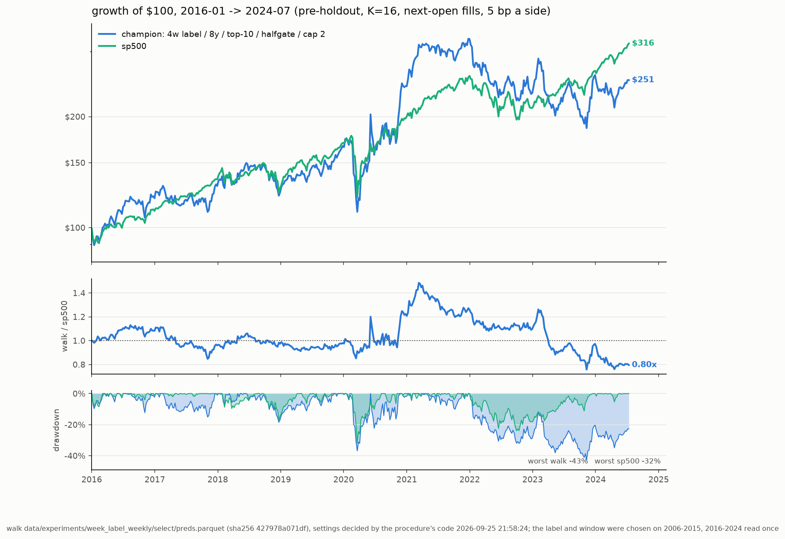

# champion: the one look

Walk `data/experiments/week_label_weekly` (4w label / 8y / top-10 / halfgate / cap 2) at K=16, settings top-10 / halfgate / stop None / cap 2 decided by `stocks-ml procedure`'s code on its 2006-2015 segment. $100 at each span's start; pre-tax (Roth); pre-holdout only. Generated 2026-09-25 21:58:34 by `stocks-ml eval`.

| model | 2006-2024: $100, %/yr | SR, DD | 2016-2024: $100, %/yr | SR, DD | 2006-2015: $100, %/yr | SR, DD | weekly t vs sp500 (06-24 / 16-24) |
|---|---|---|---|---|---|---|---|
| champion | $983, +13.1% | 0.58, 60% | $251, +11.3% | 0.52, 43% | $391, +14.6% | 0.64, 60% | +1.06 / -0.05 |
| incumbent (clean_weekly, top-10 / halfgate / stop None / cap 2) | $830, +12.1% | 0.58, 53% | $252, +11.4% | 0.54, 41% | $329, +12.6% | 0.61, 53% | +0.83 / -0.13 |
| sp500 | $621, +10.3% | 0.64, 55% | $316, +14.3% | 0.87, 32% | $197, +7.0% | 0.46, 55% | — |

Falsification (paired weekly excess vs the incumbent on 2016-2024, t < -2.0 rejects): 2016-2024 t +0.15 on 446 weeks -> **not rejected**. Edge over the incumbent, %/yr: 2006-2015 +1.98 (selection window), 2016-2024 -0.07 (the one look).

Leak audit: PASS — select: identity PASS, score-vs-split-factor +0.062 (t +8.8), IC +0.0045 (t +0.4), retention 1.368; extend: identity PASS, score-vs-split-factor +0.078 (t +9.3), IC +0.0048 (t +0.4), retention 1.106; feature scan: 6 of 50 beyond 0.15 (f_sf_debt_ebitda +0.21, f_sf_book_to_market +0.21, f_sf_roe -0.16, f_sf_gross_prof -0.16, f_sf_sales_to_price +0.16, f_sfi_buyers_13w +0.15); missingness scan: 0 of 50 whose blanks predict; sector map: one vintage applied to all history (9 sectors), used by label_4w_sector* (the training target) and the book's sector cap.

| window | metric | point | seed-only 95% | history-only 95% | nested 95% |
|---|---|---|---|---|---|
| 2016-2024 | excess CAGR vs sp500 %/yr | -2.6 | -4.4 … -0.8 | -14.5 … +10.1 | -13.8 … +10.4 |
| 2016-2024 | CAGR %/yr | +11.4 | +9.4 … +13.4 | -7.8 … +33.4 | -7.0 … +33.8 |
| 2016-2024 | terminal $100 | $251 | $215 … $294 | $50 … $1,177 | $54 … $1,205 |
| 2016-2024 | P(excess > 0), nested | 0.35 | | | |
| 2006-2024 | excess CAGR vs sp500 %/yr | +2.5 | +0.5 … +4.2 | -5.7 … +11.8 | -6.3 … +11.7 |
| 2006-2024 | CAGR %/yr | +13.1 | +10.9 … +15.1 | -0.4 … +28.9 | -0.9 … +28.2 |
| 2006-2024 | terminal $100 | $983 | $677 … $1,341 | $93 … $10,912 | $84 … $9,933 |
| 2006-2024 | P(excess > 0), nested | 0.68 | | | |
| 2006-2015 | excess CAGR vs sp500 %/yr | +7.2 | +3.5 … +9.5 | -4.2 … +20.4 | -4.8 … +20.7 |
| 2006-2015 | CAGR %/yr | +14.7 | +10.7 … +17.2 | -4.1 … +37.2 | -4.4 … +37.4 |
| 2006-2015 | terminal $100 | $391 | $276 … $485 | $66 … $2,343 | $64 … $2,364 |
| 2006-2015 | P(excess > 0), nested | 0.85 | | | |

Seed noise: the K copies resampled with replacement and re-simulated (200 draws). History noise: a circular block bootstrap of the weeks, 8-week blocks, strategy and S&P on the same weeks (4000 draws). Nested: both.

