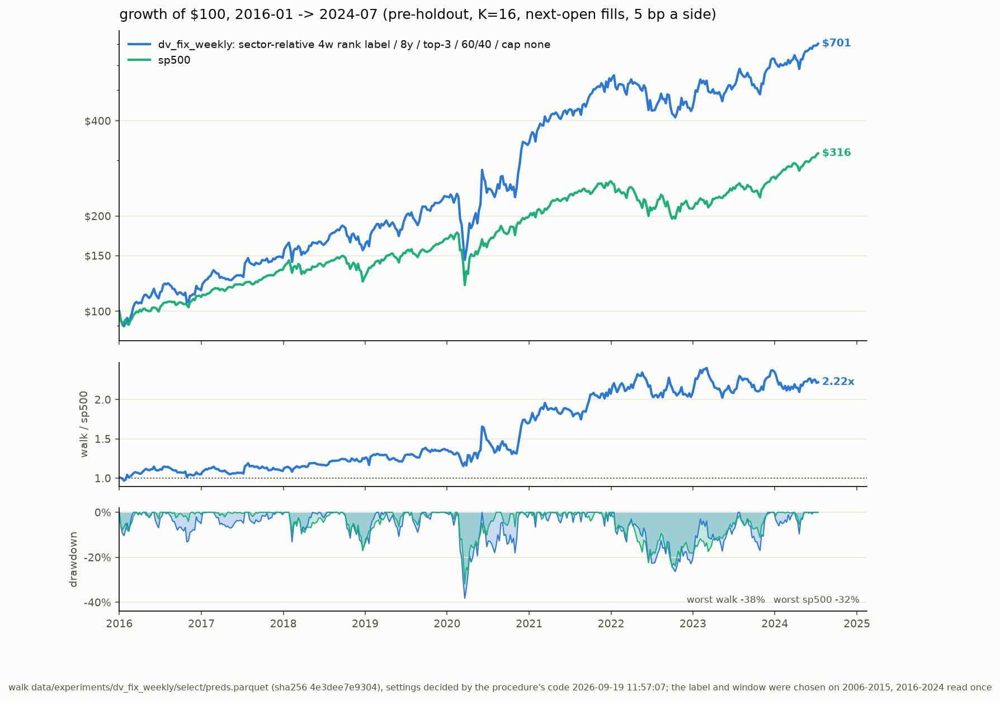

# dv_fix_weekly: the one look

Walk `data/experiments/dv_fix_weekly` (sector-relative 4w rank label / 8y / top-3 / 60/40 / cap none) at K=16, settings top-3 / 60/40 / stop None / cap None decided by `stocks-ml procedure`'s code on its 2006-2015 segment. $100 at each span's start; pre-tax (Roth); pre-holdout only. Generated 2026-09-19 11:57:15 by `stocks-ml eval`.

| model | 2006-2024: $100, %/yr | SR, DD | 2016-2024: $100, %/yr | SR, DD | 2006-2015: $100, %/yr | SR, DD | weekly t vs sp500 (06-24 / 16-24) |
|---|---|---|---|---|---|---|---|
| dv_fix_weekly | $2,945, +20.0% | 0.76, 55% | $701, +25.5% | 0.98, 38% | $420, +15.4% | 0.61, 55% | +2.32 / +1.79 |
| incumbent (rank_k16, top-3 / halfgate / stop None / cap None / vol cut abs_or_sector) | $1,774, +16.7% | 0.97, 32% | $286, +13.0% | 0.74, 26% | $621, +20.0% | 1.21, 32% | +1.94 / -0.19 |
| sp500 | $621, +10.3% | 0.64, 55% | $316, +14.3% | 0.87, 32% | $197, +7.0% | 0.46, 55% | — |

Falsification (paired weekly excess vs the incumbent on 2016-2024, t < -2.0 rejects): 2016-2024 t +1.78 on 446 weeks -> **not rejected**. Edge over the incumbent, %/yr: 2006-2015 -4.60 (selection window), 2016-2024 +12.47 (the one look).

Leak audit: PASS — select: identity PASS, score-vs-split-factor +0.007 (t +1.1), IC +0.0046 (t +0.6), retention 1.165; extend: identity PASS, score-vs-split-factor -0.017 (t -3.2), IC +0.0432 (t +5.4), retention 1.002; feature scan: 6 of 64 beyond 0.15 (f_sf_debt_ebitda +0.21, f_sf_book_to_market +0.21, f_book_to_market +0.17, f_sf_roe -0.16, f_sf_sales_to_price +0.16, f_sfi_buyers_13w +0.15).

| window | metric | point | seed-only 95% | history-only 95% | nested 95% |
|---|---|---|---|---|---|
| 2016-2024 | excess CAGR vs sp500 %/yr | +9.8 | +7.9 … +12.6 | -2.3 … +23.5 | -1.3 … +23.8 |
| 2016-2024 | CAGR %/yr | +25.6 | +23.5 … +28.8 | +5.6 … +49.0 | +6.5 … +49.3 |
| 2016-2024 | terminal $100 | $701 | $606 … $867 | $159 … $3,028 | $172 … $3,079 |
| 2016-2024 | P(excess > 0), nested | 0.95 | | | |
| 2006-2024 | excess CAGR vs sp500 %/yr | +8.8 | +6.5 … +10.3 | +0.1 … +19.0 | -0.2 … +18.6 |
| 2006-2024 | CAGR %/yr | +20.1 | +17.5 … +21.8 | +6.0 … +37.5 | +5.8 … +36.2 |
| 2006-2024 | terminal $100 | $2,945 | $1,978 … $3,822 | $291 … $36,258 | $284 … $30,531 |
| 2006-2024 | P(excess > 0), nested | 0.97 | | | |
| 2006-2015 | excess CAGR vs sp500 %/yr | +7.9 | +3.9 … +9.5 | -4.0 … +23.2 | -4.7 … +22.7 |
| 2006-2015 | CAGR %/yr | +15.5 | +11.2 … +17.2 | -3.4 … +39.5 | -4.1 … +39.0 |
| 2006-2015 | terminal $100 | $420 | $287 … $487 | $71 … $2,755 | $66 … $2,655 |
| 2006-2015 | P(excess > 0), nested | 0.87 | | | |

Seed noise: the K copies resampled with replacement and re-simulated (200 draws). History noise: a circular block bootstrap of the weeks, 8-week blocks, strategy and S&P on the same weeks (4000 draws). Nested: both.

