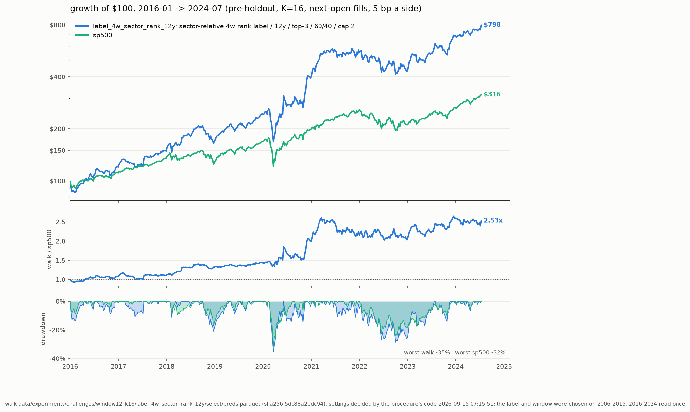

# label_4w_sector_rank_12y: the one look

Walk `data/experiments/challenges/window12_k16/label_4w_sector_rank_12y` (sector-relative 4w rank label / 12y / top-3 / 60/40 / cap 2) at K=16, settings top-3 / 60/40 / stop None / cap 2 decided by `stocks-ml procedure`'s code on its 2006-2015 segment. $100 at each span's start; pre-tax (Roth); pre-holdout only. Generated 2026-09-15 07:15:56 by `stocks-ml eval`.

| model | 2006-2024: $100, %/yr | SR, DD | 2016-2024: $100, %/yr | SR, DD | 2006-2015: $100, %/yr | SR, DD | weekly t vs sp500 (06-24 / 16-24) |
|---|---|---|---|---|---|---|---|
| label_4w_sector_rank_12y | $4,394, +22.6% | 0.87, 47% | $798, +27.4% | 1.05, 35% | $551, +18.6% | 0.73, 47% | +2.85 / +2.04 |
| incumbent (rank_k16, top-3 / halfgate / stop None / cap 2) | $4,940, +23.4% | 0.82, 49% | $844, +28.2% | 0.92, 38% | $585, +19.3% | 0.73, 49% | +2.53 / +1.71 |
| sp500 | $621, +10.3% | 0.64, 55% | $316, +14.3% | 0.87, 32% | $197, +7.0% | 0.46, 55% | — |

Falsification (paired weekly excess vs the incumbent on 2016-2024, t < -2.0 rejects): 2016-2024 t -0.45 on 446 weeks -> **not rejected**. Edge over the incumbent, %/yr: 2006-2015 -0.71 (selection window), 2016-2024 -0.85 (the one look).

Leak audit: PASS — select: identity PASS, score-vs-split-factor -0.023 (t -4.1), IC +0.0082 (t +1.1), retention 0.964; extend: identity PASS, score-vs-split-factor -0.080 (t -13.7), IC +0.0445 (t +6.3), retention 1.001.

| window | metric | point | seed-only 95% | history-only 95% | nested 95% |
|---|---|---|---|---|---|
| 2016-2024 | excess CAGR vs sp500 %/yr | +11.4 | +8.8 … +13.6 | -0.6 … +25.4 | -0.3 … +24.8 |
| 2016-2024 | CAGR %/yr | +27.5 | +24.4 … +30.0 | +7.1 … +51.5 | +7.6 … +50.4 |
| 2016-2024 | terminal $100 | $798 | $647 … $941 | $180 … $3,482 | $188 … $3,281 |
| 2016-2024 | P(excess > 0), nested | 0.97 | | | |
| 2006-2024 | excess CAGR vs sp500 %/yr | +11.2 | +6.4 … +11.3 | +2.1 … +21.6 | +0.4 … +19.2 |
| 2006-2024 | CAGR %/yr | +22.7 | +17.4 … +22.8 | +7.8 … +40.0 | +6.4 … +36.8 |
| 2006-2024 | terminal $100 | $4,394 | $1,959 … $4,489 | $402 … $51,031 | $315 … $33,263 |
| 2006-2024 | P(excess > 0), nested | 0.98 | | | |
| 2006-2015 | excess CAGR vs sp500 %/yr | +10.9 | +3.1 … +10.7 | -1.8 … +25.9 | -4.4 … +22.0 |
| 2006-2015 | CAGR %/yr | +18.7 | +10.4 … +18.5 | -0.8 … +43.0 | -4.1 … +38.3 |
| 2006-2015 | terminal $100 | $551 | $267 … $541 | $92 … $3,531 | $66 … $2,531 |
| 2006-2015 | P(excess > 0), nested | 0.87 | | | |

Seed noise: the K copies resampled with replacement and re-simulated (200 draws). History noise: a circular block bootstrap of the weeks, 8-week blocks, strategy and S&P on the same weeks (4000 draws). Nested: both.

