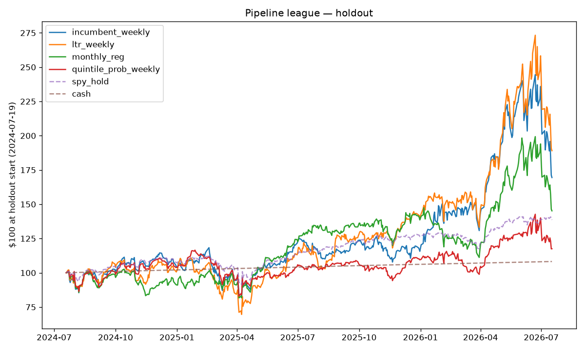

# Pipeline league — one exam, many recipes

All pipelines: $100 walked forward from 2015-03-01 through the same cost-aware simulator (5bps one-way), staggered-refit ensembles, tie guard. They differ in training objective, strategy, and cadence:

- **incumbent_weekly**: champion regression (RMSE-trained), weekly, topk_spy — the baseline
- **ltr_weekly**: learning-to-rank (rank:ndcg, week = query group), weekly, topk_spy — CV-tuned
- **monthly_reg**: CV-tuned 4-week-label regression, monthly cadence, topk_spy
- **quintile_prob_weekly**: P(top-quintile) classifier, weekly; only >50% confidence fills a slot, rest in SPY

Trials to date across the project (feeds Sharpe-deflation honesty): each league row adds one.

## Holdout (≥ 2024-07-19) — the primary comparison

Never used for tuning or selection of any pipeline.

| pipeline | $100 → | total return | ann. Sharpe | max DD | worst week |
|---|---|---|---|---|---|
| incumbent_weekly | $169 | +69.5% | 0.84 | 30.7% | -15.9% |
| ltr_weekly | $189 | +89.1% | 0.91 | 37.3% | -16.6% |
| monthly_reg | $145 | +45.2% | 0.68 | 27.2% | -14.3% |
| quintile_prob_weekly | $118 | +17.5% | 0.41 | 28.8% | -12.2% |
| spy_hold (benchmark) | $139 | +38.6% | 1.05 | 18.8% | -9.1% |
| cash (benchmark) | $108 | +8.2% | 157.31 | 0.0% | 0.1% |

## Selection window (2015-03-01 → 2024-07-19)

Overlaps the incumbent's CV/tuning window — context, not verdict.

| pipeline | $100 → | total return | ann. Sharpe | max DD | worst week |
|---|---|---|---|---|---|
| incumbent_weekly | $215 | +114.8% | 0.43 | 60.0% | -27.6% |
| ltr_weekly | $164 | +63.9% | 0.33 | 73.6% | -37.9% |
| monthly_reg | $1,205 | +1104.6% | 1.02 | 49.4% | -22.0% |
| quintile_prob_weekly | $347 | +247.1% | 0.60 | 55.7% | -27.4% |
| spy_hold (benchmark) | $315 | +215.0% | 0.78 | 33.7% | -14.5% |
| cash (benchmark) | $117 | +16.6% | 14.78 | 0.0% | -0.0% |

## Cost and fit accounting

| pipeline | rebalances/cadence | model fits | costs $ |
|---|---|---|---|
| incumbent_weekly | weekly | 594 | 37.45 |
| ltr_weekly | weekly | 594 | 37.47 |
| monthly_reg | every 4 wk | 148 | 51.33 |
| quintile_prob_weekly | weekly | 594 | 88.26 |

Honesty notes:
- Wave-1 challengers are deliberately untuned (conventional defaults); the incumbent had an Optuna budget. A challenger that competes while untuned is the interesting signal.
- Every pipeline graded here spends holdout novelty; the shadow ledger makes the final call.

