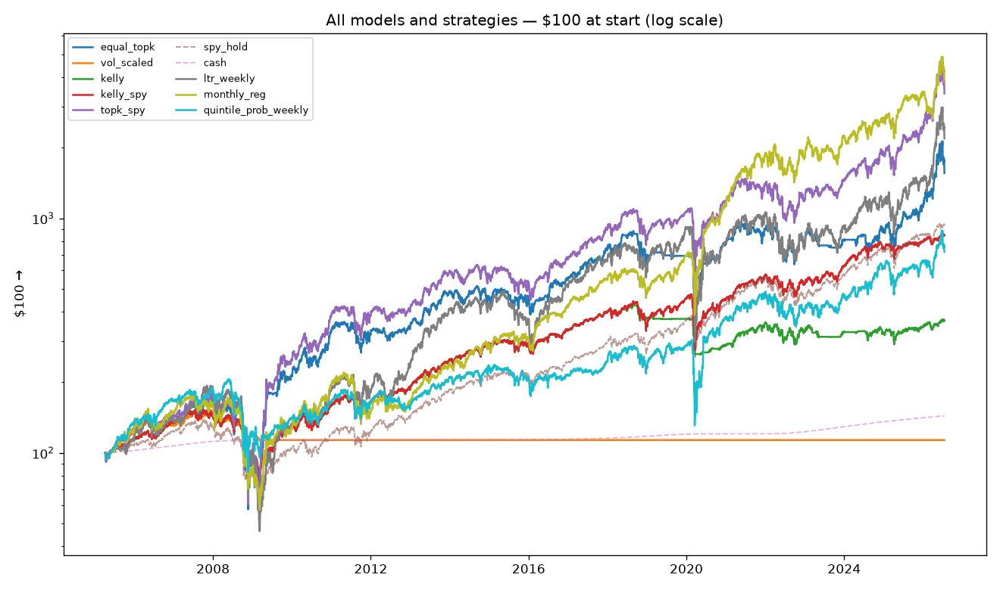
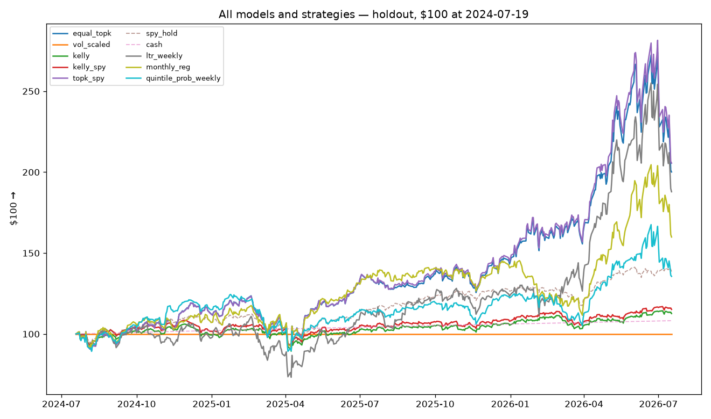

# Pipeline league — one exam, many recipes

All pipelines: $100 walked forward from 2005-01-03 through the same cost-aware simulator (5bps one-way), staggered-refit ensembles, tie guard. They differ in training objective, strategy, and cadence:

- **incumbent_weekly**: champion regression (RMSE-trained), weekly, topk_spy — the baseline
- **ltr_weekly**: learning-to-rank (rank:ndcg, week = query group), weekly, topk_spy — CV-tuned
- **monthly_reg**: CV-tuned 4-week-label regression, monthly cadence, topk_spy
- **quintile_prob_weekly**: P(top-quintile) classifier, weekly; only >50% confidence fills a slot, rest in SPY

Trials to date across the project (feeds Sharpe-deflation honesty): each league row adds one.

## Holdout (≥ 2024-07-19) — the primary comparison

Never used for tuning or selection of any pipeline.

| pipeline | $100 → | total return | ann. Sharpe | max DD | worst week |
|---|---|---|---|---|---|
| incumbent_weekly | $206 | +105.6% | 1.17 | 27.0% | -14.4% |
| ltr_weekly | $188 | +87.9% | 0.96 | 33.9% | -16.1% |
| monthly_reg | $160 | +59.9% | 0.88 | 23.2% | -13.0% |
| quintile_prob_weekly | $136 | +35.6% | 0.67 | 28.2% | -11.6% |
| spy_hold (benchmark) | $139 | +38.6% | 1.05 | 18.8% | -9.1% |
| cash (benchmark) | $108 | +8.2% | 157.31 | 0.0% | 0.1% |

## Since 2005-01-03 (full history)

Same exam as the strategy zoo. Pre-holdout years overlap the tuned pipelines' CV/tuning windows — context, not verdict; the holdout section above is the clean test.

| pipeline | $100 → | total return | ann. Sharpe | max DD | worst week |
|---|---|---|---|---|---|
| incumbent_weekly | $3,406 | +3305.7% | 0.68 | 67.6% | -26.4% |
| ltr_weekly | $2,190 | +2090.4% | 0.58 | 76.1% | -32.0% |
| monthly_reg | $3,819 | +3718.8% | 0.74 | 67.8% | -24.3% |
| quintile_prob_weekly | $719 | +619.2% | 0.48 | 59.7% | -28.8% |
| spy_hold (benchmark) | $930 | +829.9% | 0.65 | 55.2% | -19.8% |
| cash (benchmark) | $144 | +43.9% | 14.57 | 0.0% | -0.0% |

## Cost and fit accounting

| pipeline | rebalances/cadence | model fits | costs $ |
|---|---|---|---|
| incumbent_weekly | weekly | 1111 | 320.85 |
| ltr_weekly | weekly | 1111 | 258.20 |
| monthly_reg | every 4 wk | 276 | 115.17 |
| quintile_prob_weekly | weekly | 1111 | 192.46 |

Honesty notes:
- Wave-1 challengers are deliberately untuned (conventional defaults); the incumbent had an Optuna budget. A challenger that competes while untuned is the interesting signal.
- Every pipeline graded here spends holdout novelty; the shadow ledger makes the final call.

Combined view of every model and strategy:  