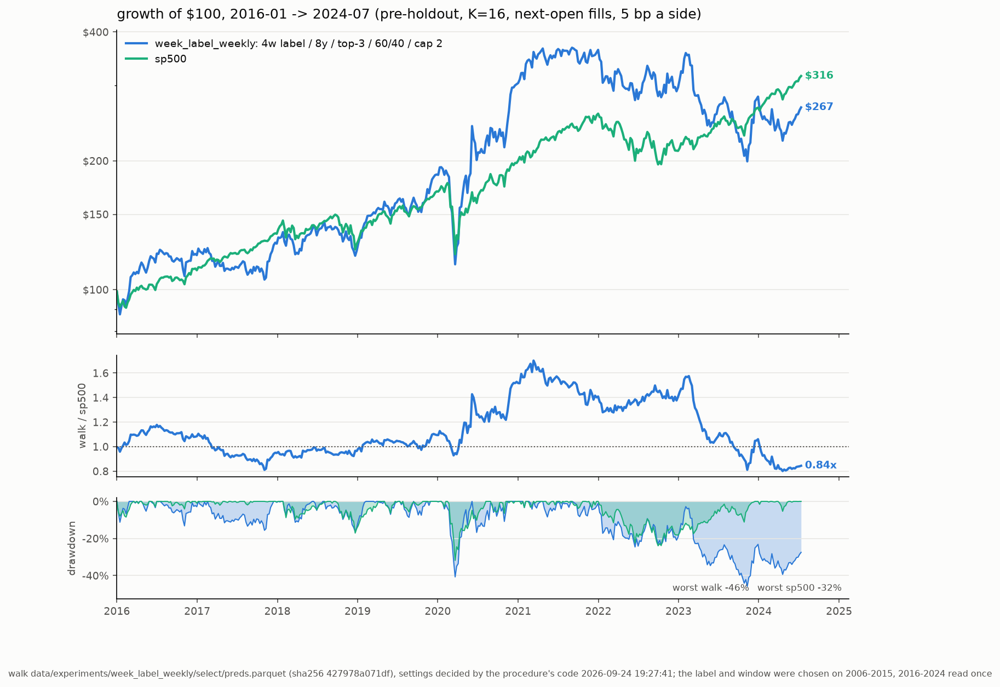

# week_label_weekly: the one look

Walk `data/experiments/week_label_weekly` (4w label / 8y / top-3 / 60/40 / cap 2) at K=16, settings top-3 / 60/40 / stop None / cap 2 decided by `stocks-ml procedure`'s code on its 2006-2015 segment. $100 at each span's start; pre-tax (Roth); pre-holdout only. Generated 2026-09-24 19:27:48 by `stocks-ml eval`.

| model | 2006-2024: $100, %/yr | SR, DD | 2016-2024: $100, %/yr | SR, DD | 2006-2015: $100, %/yr | SR, DD | weekly t vs sp500 (06-24 / 16-24) |
|---|---|---|---|---|---|---|---|
| week_label_weekly | $1,152, +14.1% | 0.58, 50% | $267, +12.1% | 0.54, 46% | $432, +15.8% | 0.61, 50% | +1.22 / +0.08 |
| incumbent (clean_weekly, top-3 / halfgate / stop None / cap 2) | $1,290, +14.8% | 0.58, 54% | $219, +9.6% | 0.43, 49% | $588, +19.4% | 0.71, 54% | +1.28 / -0.02 |
| sp500 | $621, +10.3% | 0.64, 55% | $316, +14.3% | 0.87, 32% | $197, +7.0% | 0.46, 55% | — |

Falsification (paired weekly excess vs the incumbent on 2016-2024, t < -2.0 rejects): 2016-2024 t +0.13 on 446 weeks -> **not rejected**. Edge over the incumbent, %/yr: 2006-2015 -3.63 (selection window), 2016-2024 +2.53 (the one look).

Leak audit: PASS — select: identity PASS, score-vs-split-factor +0.062 (t +8.8), IC +0.0045 (t +0.4), retention 1.368; extend: identity PASS, score-vs-split-factor +0.078 (t +9.3), IC +0.0048 (t +0.4), retention 1.106; feature scan: 6 of 50 beyond 0.15 (f_sf_debt_ebitda +0.21, f_sf_book_to_market +0.21, f_sf_roe -0.16, f_sf_gross_prof -0.16, f_sf_sales_to_price +0.16, f_sfi_buyers_13w +0.15); missingness scan: 0 of 50 whose blanks predict; sector map: one vintage applied to all history (9 sectors), used by label_4w_sector* (the training target) and the book's sector cap.

| window | metric | point | seed-only 95% | history-only 95% | nested 95% |
|---|---|---|---|---|---|
| 2016-2024 | excess CAGR vs sp500 %/yr | -2.0 | -4.6 … +1.1 | -14.8 … +13.1 | -14.3 … +13.7 |
| 2016-2024 | CAGR %/yr | +12.2 | +9.1 … +15.7 | -8.8 … +36.5 | -7.5 … +37.2 |
| 2016-2024 | terminal $100 | $267 | $210 … $347 | $46 … $1,425 | $52 … $1,492 |
| 2016-2024 | P(excess > 0), nested | 0.41 | | | |
| 2006-2024 | excess CAGR vs sp500 %/yr | +3.4 | +0.8 … +6.1 | -6.6 … +14.9 | -6.8 … +14.8 |
| 2006-2024 | CAGR %/yr | +14.1 | +11.2 … +17.1 | -0.8 … +31.9 | -0.9 … +31.6 |
| 2006-2024 | terminal $100 | $1,152 | $714 … $1,872 | $87 … $16,811 | $85 … $16,198 |
| 2006-2024 | P(excess > 0), nested | 0.73 | | | |
| 2006-2015 | excess CAGR vs sp500 %/yr | +8.2 | +4.7 … +11.7 | -6.3 … +26.2 | -6.0 … +27.8 |
| 2006-2015 | CAGR %/yr | +15.8 | +12.0 … +19.5 | -4.4 … +41.9 | -4.9 … +43.5 |
| 2006-2015 | terminal $100 | $432 | $310 … $591 | $64 … $3,260 | $61 … $3,660 |
| 2006-2015 | P(excess > 0), nested | 0.86 | | | |

Seed noise: the K copies resampled with replacement and re-simulated (200 draws). History noise: a circular block bootstrap of the weeks, 8-week blocks, strategy and S&P on the same weeks (4000 draws). Nested: both.

